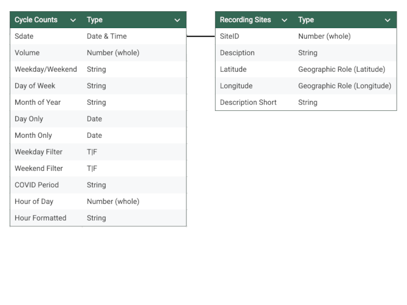

# Leeds Cycle Patterns Analysis

This analysis examines cycling patterns across Leeds to help understand infrastructure usage, inform future planning decisions, and track changes in sustainable transportation adoption over time. It features an analysis of ride volumes during 2018-2023 across 11 recording sites based on 1.2 million data points &amp; +80% daily completeness over a continuous 6 year period.

## Data Structure

The database structure as seen below consists of 2 tables, 'Cycle Counts' and 'Recording Sites':

The underlying data was sourced from <a href="https://datamillnorth.org/dataset/e1dmk/leeds-annual-cycle-growth" target="_blank">Data Mill North</a> and the steps taken to clean and check for quality control prior for analysis in Tableau can be found [here](documentation/data-prep-summary.md).

## Methodology

Data was cleaned & prepared for analysis as detailed here [here](documentation/data-prep-summary.md). It was then imported into Tableau & augmented with calculated fields to support further analysis.

## Dashboard Structure

#### 1. Overview Dashboard - The Entry Point

##### Key Metrics (BANs)
- ****Total rides**** across 2018-2023
- ****Peak month**** by ride volume
- ****Peak day**** by ride volume
- ****Peak hour**** by ride volume

##### Key Visualizations
- **City map** showing the 11 recording sites with size/color coding for volume
- **Primary time series** showing overall cycling volume 2018-2023 with COVID periods clearly marked (2020-2021)
  - Custom y-axis range (with note explaining non-zero baseline)

##### Temporal Patterns (Small Multiples)
- Volume by **day of week** (bar chart)
- Volume by **month** (bar chart)
- Volume by **hour** (line chart)

##### Summary
- Brief summary text explaining key insights from the overview dashboard

---

#### 2. Temporal Patterns Dashboard - Drilling Deeper

##### Time of Day Analysis
- **Hourly patterns** with toggles between weekday/weekend
  - Line chart showing hourly patterns with ability to filter weekend/weekday

##### Site Usage Patterns
- **Site-specific Weekday/Weekend Ratio Chart**:
  - X-axis: Recording sites
  - Y-axis: Percentage of total rides
  - Stacked bars showing weekday percentage vs weekend percentage
  - Sorted by weekday percentage to highlight commuter vs. recreational patterns

##### Trend Analysis
- **Day of week trend over time heat map**:
  - X-axis: Years (2018-2023)
  - Y-axis: Days of the week
  - Color intensity: Volume with "% of Yearly Total by Day" in tooltip

- **Monthly/seasonal patterns**:
  - Line chart with one line per year (2018-2023)
  - Shows both seasonal cycling patterns and year-over-year comparison

##### Heatmap Visualizations
- **Time-of-day by day-of-week heat map**:
  - X-axis: Hour of day (0-23)
  - Y-axis: Day of week
  - Color intensity: Volume
  - Reveals daily and hourly cycling patterns in a single visualization

- **Time-of-day by location heat map**:
  - X-axis: Hour of day (0-23)
  - Y-axis: Recording sites
  - Color intensity: Volume
  - Toggle for weekday vs weekend view
  - Shows which sites are busiest during different times of day

---

#### 3. COVID Impact Analysis Dashboard

##### Pandemic Period Comparison
- **Before/during/after comparison** with clear visual breaks:
  - Time series comparison showing pre-COVID (2018-2019), during COVID (2020-2021), and post-COVID (2022-2023)

##### Location Impact Analysis
- **Site-specific COVID impact**:
  - Bar chart showing percentage change in volume by site during COVID vs. pre-COVID
  - Highlights which sites saw biggest decreases or increases

##### Recovery Tracking
- **Recovery patterns**:
  - Line chart showing monthly volume indexed to pre-COVID baseline (100%)
  - Shows which sites recovered fastest and to what extent

##### Behavioral Change Analysis
- **Behavioral shifts**:
  - Comparison of weekend vs. weekday riding patterns before and after COVID
  - Shows whether COVID permanently altered cycling habits

## Key findings

xxx

## How to view the dashboard

xx

## Caveats & Assumptions

xxx
