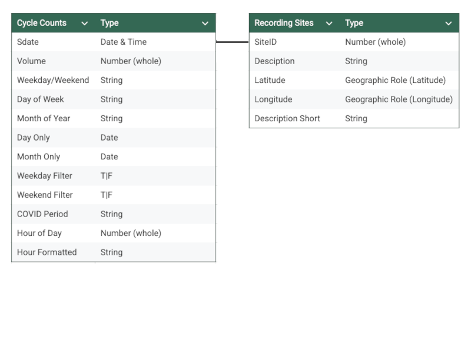

# Leeds-Cycle-Patterns-Analysis
Analysis of ride volumes 2018-23 across 11 recording sites based on 1.2 million data points &amp; +80% daily completeness over a continuous 6 year period.

## Data Structure

The databae structure as seen below consists of 2 tables, Cycle Counts and Recording Sites:

The underlying data was sourced from <a href="https://datamillnorth.org/dataset/e1dmk/leeds-annual-cycle-growth" target="_blank">Data Mill North</a>. The process used to clean the data and checks for quality control prior for analysis in Tableau can be found <a href="">here</a>.

## Methodology

xxx

## Key findings

xxx

## How to view the dashboard

xx

## Caveats & Assumptions

xxx
