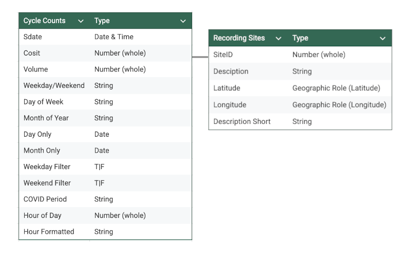

# Leeds Cycle Patterns Analysis

This analysis examines cycling patterns across Leeds to help understand infrastructure usage, inform future planning decisions, and track changes in sustainable transportation adoption over time. It features an analysis of ride volumes during 2018-2023 across 11 recording sites based on 1.2 million data points &amp; +80% daily completeness over a continuous 6 year period.

## Data Structure

The database structure as seen below consists of 2 tables, 'Cycle Counts' and 'Recording Sites':

The underlying data was sourced from <a href="https://datamillnorth.org/dataset/e1dmk/leeds-annual-cycle-growth" target="_blank">Data Mill North</a> and the steps taken to clean and check for quality control prior for analysis in Tableau can be found [here](documentation/data-prep-summary.md).

## Methodology

Data was cleaned & prepared for analysis as detailed here [here](documentation/data-prep-summary.md). It was then imported into Tableau & augmented with calculated fields to support further analysis.

## Dashboard Structure

### 1. Overview Dashboard - The Entry Point

#### Key Metrics (BANs)
- **Total rides** across 2018-2023
- **Peak month** by ride volume
- **Peak day** by ride volume
- **Peak hour** by ride volume

#### Key Visualizations
- **City map** showing the 11 recording sites with size/color coding for volume
- **Primary time series** showing overall cycling volume 2018-2023 with COVID periods clearly marked (2020-2021)

#### Temporal Patterns
- Volume by **month** (bar chart)
- Volume by **day of week** (bar chart)
- Volume by **hour** (line chart)

### 2. Temporal Patterns Dashboard - Drilling Deeper

#### Time of Day Analysis
- **Hourly patterns** showing weekday/weekend (line chart)

#### Site Usage Patterns
- **Site-specific Weekday/Weekend Ratio Chart** stacked bars showing weekday percentage vs weekend percentage

#### Trend Analysis
- **Day of week trend over time heat map** showing daily cycling patterns by year

#### Heatmap Visualizations
- **Time-of-day by day-of-week heat map** showing hourly cycling patterns byt day of week
- **Time-of-day by location heat map** showing which sites are busiest during different times of day

### 3. COVID Impact Analysis Dashboard

#### Location Impact Analysis
- **Site-specific COVID impact** showing percentage change in volume by site pre/during/post COVID (bar chart)
    
#### Pandemic Period Comparison
- **Before/during/after comparison** showing pre(18-19), during(20-21), and post (22-23) (bar chart)

#### Recovery Tracking
- **Recovery patterns** showing which sites recovered and to what extent (bar chart)

#### Behavioral Change Analysis
- **Behavioral shifts** comparison of weekend vs. weekday riding patterns pre/during/post COVID (bar chart)

## Key findings

- **Peak Month** is September, **Peak Day** is Tuesday & **Peak Hour** is 5:00PM-6:00PM
- **Weekday peak hour** is 5:00PM-6:00PM with 361K rides, 613% higher than the **weekend peak hour** 2:00PM-3:00PM with 51K rides
- **Armley Road** is the most comuter heavy site with 85% of all rides occuring on weekdays
- **A64 Killingbeck East** is the most weekend active site with 20% of all rides occuring on weekends
- **Regent Street Gower Street**: is the most active site at 5:00PM-6:00PM with 83K rides, 12.6% of location total
- **Regent Street Gower Street** saw the largest decrease in ride volume during COVID with a drop of 24.2%
- **Eight out of eleven** recording sites have seen ride volume fully recover post COVID
- **Weekday post COVID ride volume is up 3.7%** whilst **weekend is up 41.8%** compared to pre COVID levels
- **A64 Burmantofts West** saw the largest recovery with post COVID ride volume up 155% vs. pre COVID levels

## How to view the dashboard

The Tableau dashboard is available to view [here](https://public.tableau.com/app/profile/dom.barry/viz/LeedsCyclePatternsAnalysis/Overview)

## Caveats & Assumptions

xxx
