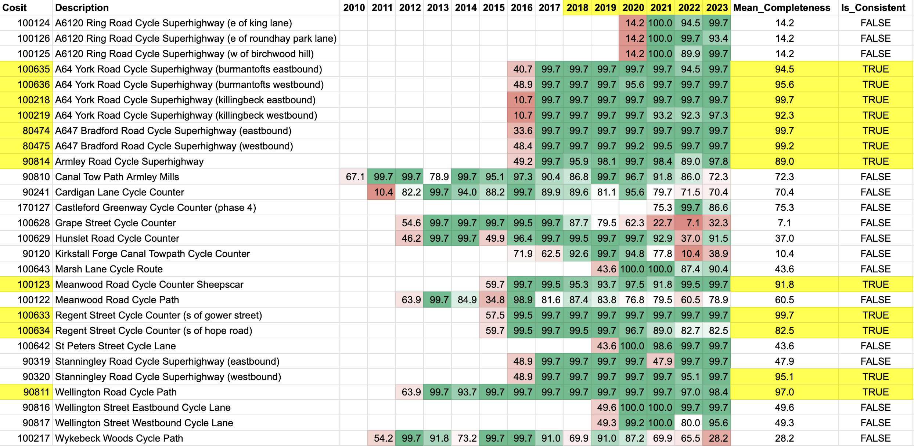

# Data preparation and cleaning

## Data source & summary

The source dataset [Leeds Annual Cycle Growth](https://datamillnorth.org/dataset/e1dmk/leeds-annual-cycle-growth) contains cycle counts from 28 recorders located around the Leeds district. Prior to June 2024 the dataset included information from 13 additional recorders within the West Yorkshire district. At the time of analysis the available data covered the period April 2010 to September 2024. I used AI tools (Claude) to accelerate my workflow while applying my domain knowledge and analytical thinking to create python scripts utilising pandas which I ran locally in R Studio.

## Data columns

- Sdate - indicates the date and time the count was taken.
- Cosit - site ID number which indicates the recorder location (see Counter Locations document below).
- Period - length of time count was taken.
- LaneNumber - Lane ID number which indicates the number of lanes.
- LaneDescription - legacy description of the direction of the lane.
- LaneDirection - the number of directions the lane or lanes go.
- Direction - the direction of the lane.
- Volume - the number of bicycles counted, if the number is negative the count has been discarded.
- Flag Text - Additional information e.g. roadworks, holiday, etc

## Preparation

- Download 64 csv files the period Jan 2010 to Sep 2024
- Concatenate csv files to combined_cycle_counts.csv (5801724 rows)
- Filter out 13 additional recorders within the West Yorkshire district (1159580 rows, 19.99% of data)
- Save filtered file as leeds_cycle_counts.csv (4642144 rows)
- Duplicate & backup for reference

## Data cleaning
### Duplicates
- **Issue**: 19 exact duplicate rows found (0.0004%)
- **Severity**: Low
- **Action**: Delete duplicate rows
  
### Negative values
- **Issue**: Volume has 25,438 negative values (0.5480% of total records) distributed over 2010 to 2021, with majority in 14-16 & 18-20 periods
- **Severity**: Low
- **Action**: Delete

### Outliers
- **Issue**: Volume has '5641' on 03/07/2014 22:00, next highest value is 415
- **Severity**: Low
- **Action**: Delete

### Inconsistent category values
#### LaneDescription 
- **Issue**: Categorical inconsistencies which vary over time: Westbound, Eastbound, Southbound, Northbound, Cycle Path Southbound, Footpath Southbound, Footpath Northbound, Cycle Path Northbound, West 2, East 1, West 1, East 2, Eastbound, North Bound, South Bound, Cycle Path N, Footpath SB, Cycle Path S, Footpath NB 
- **Severity**: Low
- **Action**: Retain but don't use this column for analysis as it's not clear how to interpret these
    
#### LaneDirection
- **Issue**: Categorical number value (1-4) which doesn't consistently correspond to direction description values e.g. 1 can be east or west
- **Severity**: Low
- **Action**: Retain but don't use this column for analysis as it's not clear how to interpret these

#### DirectionDescription
- **Issue**: 4 inconsistent categorical values "North West" vs "Northwest"
- **Severity**: Low
- **Action**: Correct to be consistent 

#### Flag Text
- **Issue**: Multiple values which have changed over time
- **Severity**: As we are not looking at flow analysis it is low
- **Action**: Retain but don't use this column for analysis as it's not clear how to interpret these

### Missing Data
#### Recording completeness by year varies between 4 to 15 years 
- **Issue**: # of recording sites has changed from 1 in 2010 to 27 in 2024 (down from 28 in 2023)
- **Severity**: High
- **Action**: Verify data recording completeness & identify a consistent set of recording sites over a date range

#### LaneDescription & Flag Text
- **Issue**: Missing 11% & 5% of values between 2010 to 2014
- **Severity**: Low, not a key measure for the analysis
- **Action**: Retain but don't use this column for analysis as it's not clear how to interpret these 

### Format checks 
- **Sdate**: dd/mm/yyyy mm:hh validated date time format
- **Cosit**: Validated against supplied site list
- **Period**: Validated number format, 1 unique non null value
- **LaneNumber**: Validated number format, 4 unique non null values
- **LaneDescription**: Validated text format, 19 unique non null values
- **LaneDirection**: Validated number format, 4 unique non null values
- **DirectionDescription**: Validated text format, 9 unique non null values
- **Volume**: Validated number format
- **Flag Text**: Validated text format, 35 unique non null values, categorical inconsistencies

## Data Cleaning Scripts

A selection of scripts I created with claude.ai & used in the data preparation process are listed below:

- [Check Exact Duplicates](../data-cleaning/cleaning-scripts/check_exact_duplicates.py) - Checks for exact duplicate rows in the dataset (all columns identical)
- [Remove Exact Duplicates](../data-cleaning/cleaning-scripts/remove_exact_duplicates.py) - Removes exact duplicate rows from the dataset and saves to a new CSV file
- [Verify Volume Values](../data-cleaning/cleaning-scripts/verify_volume_values.py) - Verifies that Volume column contains only numeric values and shows top/bottom 5 values with counts
- [Analyze Volume Statistics](../data-cleaning/cleaning-scripts/analyze_volume_statistics.py) - Generates comprehensive summary statistics for the Volume column
- [Analyze Negative Volumes by Year](../data-cleaning/cleaning-scripts/analyze_negative_volumes_by_year.py) - Analyzes negative Volume values and breaks down the results by year
- [Remove Negative Volumes](../data-cleaning/cleaning-scripts/remove_negative_volumes.py) - Removes all rows with negative Volume values and saves to a new CSV file
- [Analyze Volume Outliers](../data-cleaning/cleaning-scripts/analyze_volume_outliers.py) - Identifies outliers in Volume values and breaks down the results by year and calendar date
- [Remove Specific Outliers](../data-cleaning/cleaning-scripts/remove_specific_outlier.py) - Removes the specific row with Volume value equal to the outlier_value
- [Verfify LaneDescriptions](../data-cleaning/cleaning-scripts/verify_lane_descriptions.py) - Verifies that all values in LaneDescription column are strings, outputs unique values & counts
- [Verify Lane Direction](../data-cleaning/cleaning-scripts/verify_lane_direction.py) - Verifies that LaneDirection column contains only numbers and identifies all unique values
- [Verify DirectionDescription](../data-cleaning/cleaning-scripts/verify_direction_description.py) - Verifies that DirectionDescription column contains only string values and identifies all unique values
- [Verify Flag Text](../data-cleaning/cleaning-scripts/verify_flag_text.py) - Verifies that Flag Text column contains only string values and shows all unique values
- [Recording Completeness](../data-cleaning/cleaning-scripts/recording_completeness.py) - Analyzes the recording completeness by calculating, for each year and Cosit, the percentage of days where data was recorded for all 24 hours
- [Filter High Completeness Cosits](../data-cleaning/cleaning-scripts/filter_high_completeness_cosits.py) - Filters the dataset to include only specified Cosits within a date range

## Sample Data

- [Sample Cleaned Dataset (100 rows)](../data-cleaning/cleaned-data/leeds_cycle_counts_sample.csv) - Representative sample of the full cleaned dataset

## Recording Completeness

A table showing recording completeness for each year and cosit is shown below, highlighting the 12 sites & 6 consecutive years in yellow where daily recording completeness was higher than 80%.

## Summary & Caveats

As recording data was only available up to September 2024 I chose to focus only on complete years, in this case going up to 2023. There were 12 recording sites where # of days with complete data was > 80% every year for the 6 year period 2017-2023. One of these sites is Stanningley Road Cycle Superhighway (westbound) however the corresponding site at Stanningley Road Cycle Superhighway (eastbound) did not achieve the same level of yearly consistency. So the data is not skewed I decided to remove Stanningley Road Cycle Superhighway (westbound) leaving 11 recording sites in my cleaned data set.
